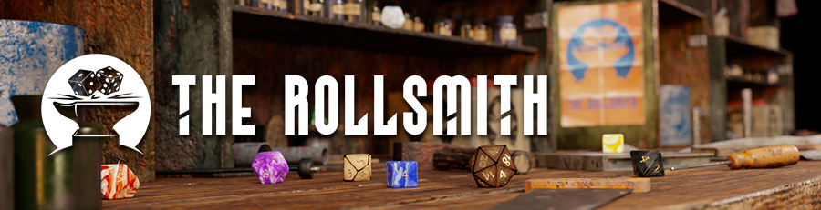
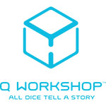
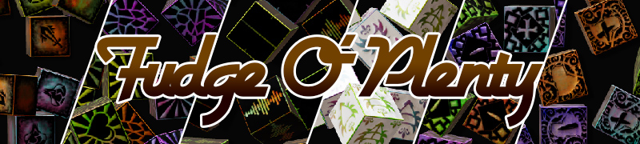
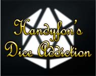

A curated list of community-made add-ons for Dice So Nice! - custom 3D models, themes, textures, and more.

## 3D Models

### The Rollsmith

https://therollsmith.com

> The Rollsmith is a small workshop creating virtual 3D dice handcrafted with love by two friends, Navy and JDW. She's the talented artist and he's the developer working on the Dice So Nice module.

### Q-Workshop

https://q-workshop.com/en/213-virtual-dice

> Q-Workshop offers both digital-only purchase and hybrid purchase on some of their dice sets. Q-Workshop is a Polish company located in Poznań that specializes in design and production of polyhedral dice and dice accessories for use in various games.

### Weighted Companion Cube Dice Set

https://foundryvtt.com/packages/wcube/

> Adds a set of 3D dice in the style of Aperture Science Weighted Companion Cube to Dice So Nice.

## Themes

### Lordudice

https://foundryvtt.com/packages/lordudice/

> Adds two new systems: one with custom dice labeling for dark/horror-type games (Dark Deeds) and another (Forbidden Knowledge) with custom styles using new fonts.

### Nice More Dice

https://foundryvtt.com/packages/nice-more-dice

> An addon to Dice So Nice adding more textures and dice faces for extra customization options.

### Fudge O' Plenty

https://foundryvtt.com/packages/fudgeoplenty

> An addon adding more dice faces for Fudge/Fate dice.

### Entice with Dice So Nice

https://foundryvtt.com/packages/entice-with-dice-so-nice

> Adds more textures for extra dice customization options.

### Talis Dice

https://foundryvtt.com/packages/talisdice

> Texture sets for Dice So Nice!

### Talis Dice - Flower

https://www.foundryvtt-hub.com/package/talisdice-flower/

> Talis flower dice set for Dice So Nice.

### Handyfon's Dice Addiction

https://foundryvtt.com/packages/diceaddiction

> MORE DICE, MORE OPTIONS TO SCRATCH THE ITCH!

### Bean Dice

https://www.foundryvtt-hub.com/package/bean-dice/

> Adds a bean texture for Dice So Nice.

---

:::note[Want to be listed here?]
If you have created a dice add-on for Dice So Nice! and would like it added to this list, open an issue on [GitLab](https://gitlab.com/riccisi/foundryvtt-dice-so-nice/-/issues) or reach out on the Foundry VTT Discord.
:::
