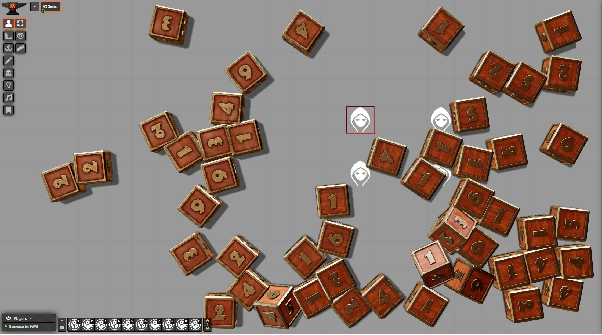
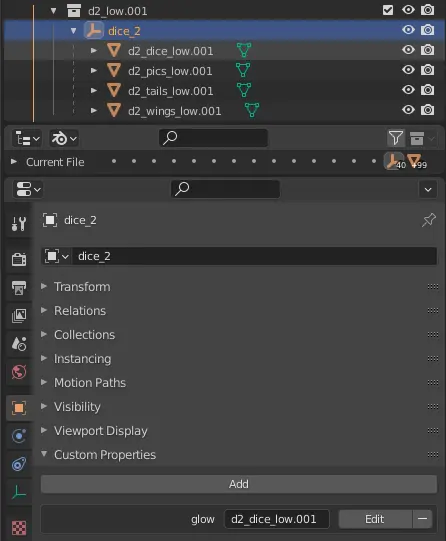
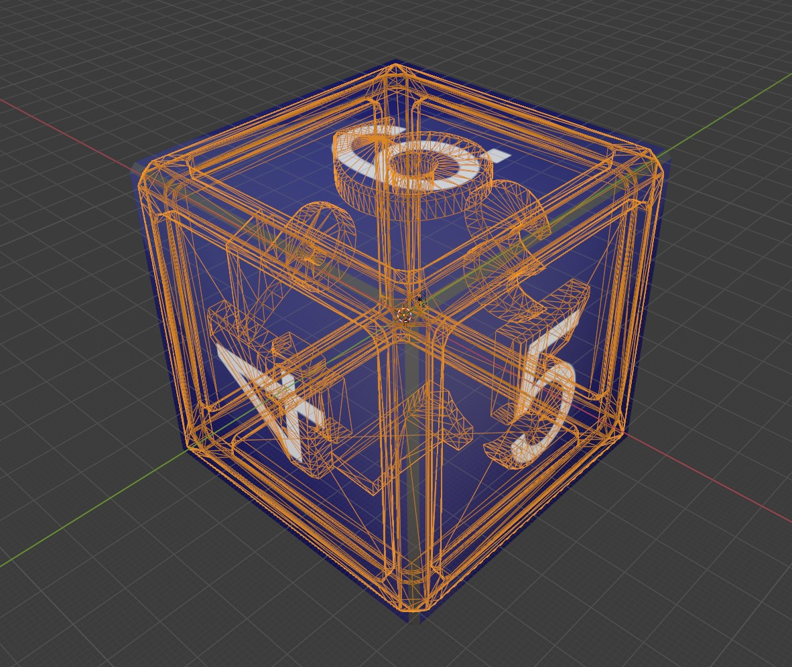
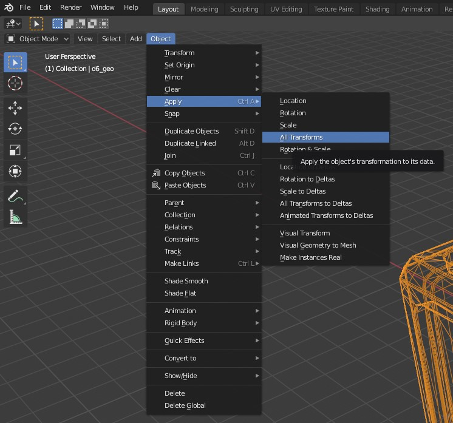
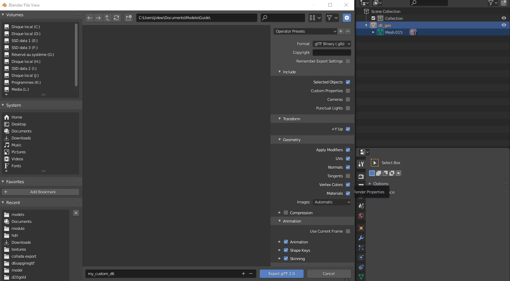

On top of the customization of the existing dice models, you can also import your own custom 3D files.
This guide will lead you through the steps needed to export a 3D model compatible with 'Dice So Nice!'.

## File format
As 'Dice So Nice!' is based on the [ThreeJS engine](https://threejs.org/), itself based on WebGL, the only supported format is [glTF](https://www.khronos.org/gltf/).
This format is natively supported in the amazing open-sourced software [Blender](https://www.blender.org/), and as such, we'll be using it as our 3D editor in this guide.

Exported glTF/glb files can use [Draco compression](https://google.github.io/draco/), which is natively supported by the module and significantly reduces file size.

## Animations
By default, Dice So Nice will play the first animation track in a loop as if it were the "idle" animation of the dice. To add more animations, you need to trigger them manually by using the [Events API](/foundryvtt-dice-so-nice/api/events/).

## Step 1: Create your 3D model
We won't go into details here as this is not the place. Just keep in mind the following tips:
- Use the same number position as 'Dice So Nice!' dice models. Meaning your 6 must be at the opposite side of your 1 on a d6, like our own models. You can find our 3D models down below.
- Do not use oversized textures. 1024px is largely enough considering the size of the 3D dice in Foundry. Using larger textures will impact performances while being unnoticeable from a smaller texture.
- You must use only Principled BSDF shaders
- You can use any of the supported maps, including but not limited to:
  - Normal or bump maps
  - Roughness map
  - Metalness map
  - Clearcoat map
  - Alpha map
- Make it low-poly. Performances matter in WebGL, and they matter even more in Foundry as your 3D model will roll on the screen on top of a running Foundry VTT! So check your poly count (you can use transforms) and use one-sided polygons when you can.

### Support for custom Dice So Nice shaders and effects
DsN adds some special shaders and special effects. If you wish to use them or make your dice compatible with them, please follow these instructions:
#### Glow/Darkness special effect
By default, Dice So Nice will try to use the root element of your 3D object as the mesh for applying the special effects. If your root object is not your mesh, you need to tell DsN which one to use by adding a custom parameter (userData) to the corresponding object.

**name:** glow
**value:** name of the object to use for the effect



## Step 2: Alignment, rotation, and scale
Before exporting your model, you'll need to align and scale it to the same size and position as our own 3D models.
To do this, we provide in our repository each model in glTF format for you to import into your software as a template.

[Download 'Dice So Nice!' 3D models here](https://gitlab.com/riccisi/foundryvtt-dice-so-nice/-/tree/master/models)

After importing the corresponding 3D template, you have to modify your own model to align it, rescale it and rotate it as best as possible. **Do not modify the 'Dice So Nice!' model. This won't work!**



Once you have managed to do that, make sure to `apply` every transformation to your model. If you do not do this, your alignment and scale won't be exported correctly.



## Step 3: Export your model
Select your entire model and make sure you didn't select anything else (no camera/light/etc.).
Then go to File -> Export -> glTF 2.0.

You can use the following settings before clicking `Export`.



## Step 4: Load your model in 'Dice So Nice!'
At this point, you should have exported a `.glb` file. This is the file containing your 3D model and every texture it uses.
To improve loading time, it is possible to load a separate `.gltf` file and convert your exported texture to WebP.
Now the only thing left to do is to create a new DicePreset like described in the [Customization API](/foundryvtt-dice-so-nice/api/customization/#adding-a-custom-dicepreset-dice-faces) with one change: the **modelFile** attribute will replace the **labels** and **bumpMaps** attributes.

```javascript
dice3d.addDicePreset({
    type: 'd6',
    modelFile: 'modules/my_module/d6model.glb',
    system: 'my_system'
});
```
