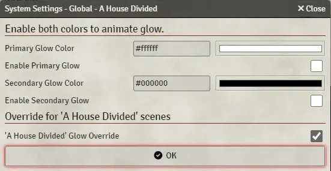

The `DiceSystem` class provides a robust framework for managing various types of settings related to dice systems. These settings work like native Dice So Nice settings like "texture" or "font style." They are also shared across users in the same way. They can be of different types, such as boolean, string, color, file, etc.

## Adding Settings

To add a setting to a `DiceSystem`, you can use one of the provided methods such as `addSettingBoolean`, `addSettingString`, `addSettingColor`, `addSettingFile`, and `addSettingSelect`. Each method requires an argument object that specifies the properties of the setting.

### Boolean Setting

A boolean setting allows you to store a true/false value.

```javascript
myDSNSystem.addSettingBoolean({
    id: 'enableFeatureX',
    name: 'Enable Feature X',
    defaultValue: false
});
```

### String Setting

A string setting allows you to store a text value.

```javascript
myDSNSystem.addSettingString({
    id: 'userName',
    name: 'User Name',
    defaultValue: 'Anonymous'
});
```

### Color Setting

A color setting allows you to store a color value in HEX format.

```javascript
myDSNSystem.addSettingColor({
    id: 'backgroundColor',
    name: 'Background Color',
    defaultValue: '#FFFFFF'
});
```

### File Setting

A file setting allows you to store a reference to a file.

```javascript
myDSNSystem.addSettingFile({
    id: 'customTexture',
    name: 'Custom Texture',
    defaultValue: ''
});
```

### Select Setting

A select setting allows you to choose from a list of options.

```javascript
myDSNSystem.addSettingSelect({
    id: 'diceType',
    name: 'Dice Type',
    defaultValue: 'd6',
    options: {
        d4: 'D4',
        d6: 'D6',
        d8: 'D8',
        d10: 'D10',
        d12: 'D12',
        d20: 'D20'
    }
});
```

## Formatting Settings

The `DiceSystem` class also supports special formatting settings, which can be used to add visual elements or custom HTML content to the settings dialog.

### Separator

A separator is a visual element used to organize settings into sections.

```javascript
myDSNSystem.addSettingSeparator({ name: 'General Settings' });
```

### HTML

An HTML setting allows you to include custom HTML content in the settings dialog.

```javascript
myDSNSystem.addSettingHTML({ name: '<strong>Custom HTML Content</strong>' });
```

## Retrieving and Using Settings

You can access these settings in the `onProcessMaterial` appearance parameter or in the `onBeforeShaderCompile` settings parameter. To learn more, see the [Custom shaders](/foundryvtt-dice-so-nice/api/shaders/) documentation.

## Full demo


```js
const HDSystem = new DiceSystem(
    'trs-housedivided-dice-set',
    'A House Divided',
    'default',
    'The Rollsmith'
);
HDSystem.addSettingHTML({
    name: '<h3>Enable both colors to animate glow.</h3>'
});
HDSystem.addSettingColor({
    id: 'color1',
    name: 'Primary Glow Color',
    defaultValue: '#6866b4'
});
HDSystem.addSettingBoolean({
    id: 'enableColor1',
    name: 'Enable Primary Glow',
    defaultValue: false
});
HDSystem.addSettingColor({
    id: 'color2',
    name: 'Secondary Glow Color',
    defaultValue: '#b74a01'
});
HDSystem.addSettingBoolean({
    id: 'enableColor2',
    name: 'Enable Secondary Glow',
    defaultValue: false
});

if (game.modules.get('house-divided')?.active) {
    HDSystem.addSettingHTML({
        name: "<h3>Override for 'A House Divided' scenes</h3>"
    });
    HDSystem.addSettingBoolean({
        id: 'enableHouseDividedAutoGlow',
        name: "'A House Divided' Glow Override",
        defaultValue: true
    });
}
```
