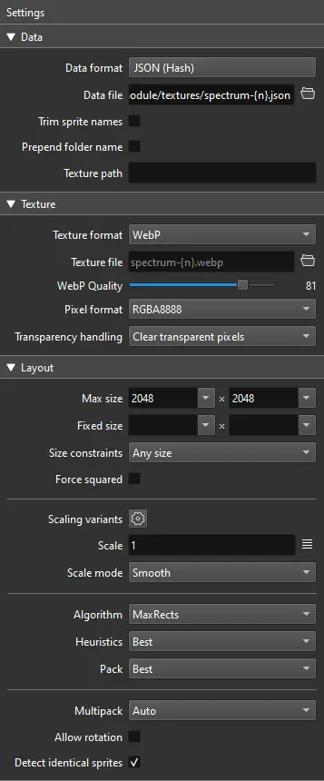
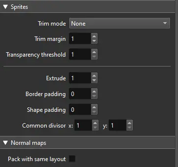

Dice So Nice supports [TexturePacker](https://www.codeandweb.com/texturepacker) sprite sheets in Dice Presets to improve loading time.

Dice So Nice will load and cache a sprite sheet (there is no risk of loading it twice) and look for any referenced image name in the Dice Preset atlas before loading an image.

This means you can mix single image URLs and sprites in a single Dice Preset.

## Settings
Here are the supported settings for creating a spritesheet.

See the DiceDefaultPresets.js file for more examples of how to use a sprite sheet
