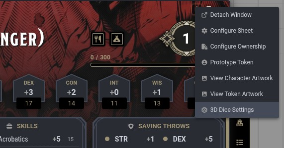

Per-actor appearance lets you configure a unique dice look for individual characters. When an actor has its own appearance, those settings overlay on top of the owning player's dice, so each character can roll with distinctive dice without changing the player's own configuration.

## How It Works

Actor appearance works as an overlay. You only configure what you want to change. Any setting you leave untouched falls back to the player's own appearance.

For example, if you set a character's theme to "Poison" but don't change the font, the character's dice will use the Poison theme with the player's font. This applies per die type too: if you customize the d20 for an actor but not the d6, the d6 falls through to the player's settings.

When a roll is made, the resolution order is:

1. Actor appearance (if the actor has one configured)
2. Player appearance
3. Default appearance

Actor appearance always takes priority when present.

## Configuring Actor Appearance

To set up a per-actor appearance:

1. Open the actor's character sheet.
2. Click the **header menu** (top-right of the sheet) and select **3D Dice Settings**.
3. The Dice So Nice! configuration dialog opens in actor mode, showing only appearance controls.
4. Adjust the appearance settings for this character.
5. Click **Apply** or **OK** to save.

In actor mode, only the Appearance tab is available. Preferences, Special Effects, Display, and Profiles are not available.

## Resetting Actor Appearance

To remove a character's custom appearance and revert to using the player's dice:

1. Open the actor's dice configuration (dice icon in the sheet header).
2. Click the **Reset** button in the footer.
3. Confirm the reset.

The actor's appearance data is cleared and the character will use the player's dice appearance again.

## Multiplayer

When a player rolls as a character that has a custom appearance, all other players in the session see the actor's dice. The appearance data is included in the roll's network message, so remote clients resolve it automatically.

## Limitations

- **ApplicationV2 sheets only.** The header button uses Foundry's V2 application hook system. Game systems still using the legacy V1 ActorSheet will not show the dice config button in the header.
- **No export/import.** Actor appearances are stored as `flags` on the actor document. The Profiles & Data export/import covers player-level data only.
