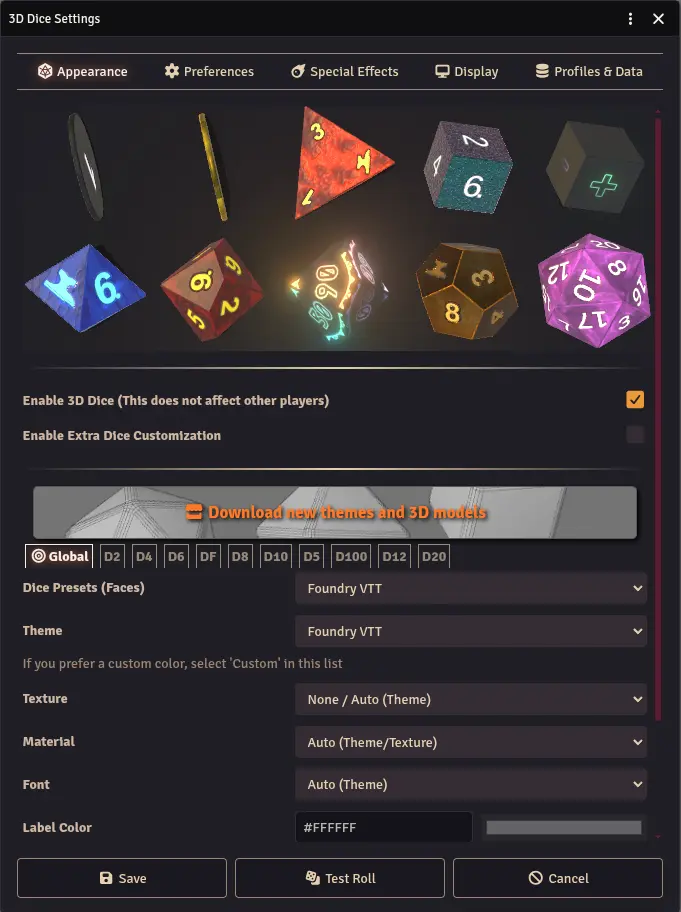

The Appearance tab controls the visual style of your dice. Every setting here is per-player and per-world.

## Global Settings

These apply to all your dice by default:

- **Dice Presets (Faces)** - Select the dice face style. "Standard" uses text labels on every face. Some game systems force a specific preset for all players to display their own custom dice.
- **Theme** - Select a color theme. Themes change all color settings at once and can include multiple random colors selected each roll. A theme may also include a default texture.
- **Texture** - Select a texture for the dice. Choose "None / Auto (Theme)" to use the theme's built-in texture, if any.
- **Material** - Select a material (plastic, metal, glass, chrome, etc.). "Auto (Theme)" uses the theme's default material.
- **Font** - Select a font for the dice labels. "Auto (Theme)" uses the theme's font. Dice So Nice! uses Foundry VTT's font system, so any font added via Foundry's Font Manager will be available here.

## Color Pickers

Four color pickers let you fine-tune the dice appearance:

- **Label Color** - The color of the text/numbers on each face.
- **Dice Color** - The base color of the dice body.
- **Outline Color** - The color of the outline around each label.
- **Edge Color** - The color of the dice edges (bevels).

## Per-Die Customization

You can customize individual die types instead of using global settings for all dice:

1. **Click on any die** in the 3D preview to select it.
2. Adjust settings for that specific die type (e.g., give your d20 a different color than your d6).
3. Per-die settings override the global settings for that die type only.

When a die type is selected, you can also open the [Dice Library](/foundryvtt-dice-so-nice/guide/dice-library/) from the Appearance tab to browse and apply custom dice.

## Extra Dice Customization

Enable **Extra Dice Customization** to access appearance settings for special dice types like d3, d5, d7, d14, d16, d24, and d30. These dice are less common but used by some game systems (e.g., DCC).

## Disabling 3D Dice

If a player does not want 3D dice animations, they can disable them from the Appearance tab. This only affects that player. Other players continue to see their own 3D dice normally.
