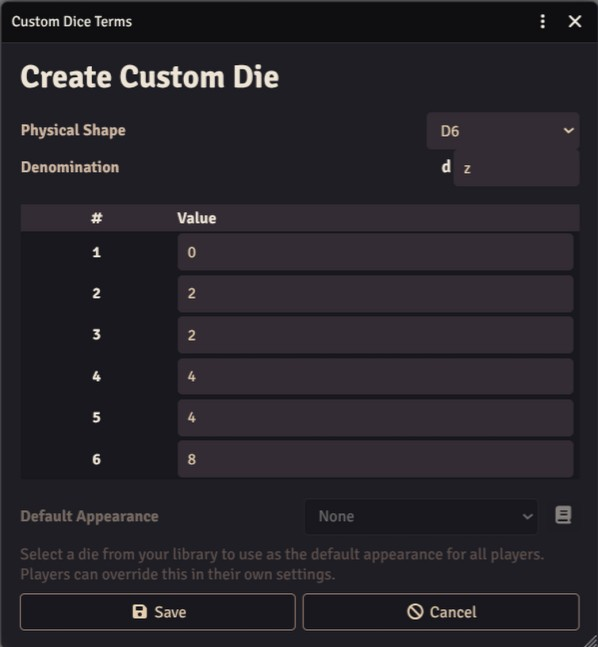

Custom Dice Terms let the GM create new dice types through a GUI. Each custom die uses an existing physical shape (d6, d8, d20, etc.) but with your own face values. Once created, anyone in the world can use them in roll formulas just like built-in dice.

For example, you could create a **dw** — a d8-shaped die where face values represent wound severity levels (0 through 7), or a **ds** — a d6-shaped die with values -1, -1, 0, 0, 1, 1 for a success/failure die.



## Who Can Create Custom Dice Terms?

Only the **Game Master** can create, edit, and delete custom dice term definitions. Players can roll custom dice and customize their appearance, but cannot modify the definitions.

## Accessing the Dialog

1. Open **Module Settings** (gear icon in the sidebar > Module Settings).
2. Find **Dice So Nice!** in the list.
3. Click **Custom Dice Terms** to open the configuration dialog.

## Creating a Custom Die

1. Click **Create New** in the Custom Dice Terms dialog.
2. Select a **Physical Shape** — this determines the 3D shape and number of faces. All standard shapes are available: d2, d4, d6, d8, d10, d12, d14, d16, d20, d24, d30.
3. Enter a **Denomination** — a single letter (a–z) that will identify your die in roll formulas. For example, entering `w` creates a die you roll as `dw`. The letter cannot conflict with an existing dice term (such as `f` for Fate dice or `c` for coins).
4. Set the **Value** for each face. The table shows one row per face, pre-filled with sequential values (1, 2, 3, ...). Change them to whatever you need — values can be negative, zero, duplicated, or in any order.
5. Click **Save**.

The custom die is immediately available to all connected players without requiring a page reload.

## Rolling Custom Dice

Use the denomination in roll formulas exactly like built-in dice:

```
/r 1dw
/r 2dw + 3
/r 1dw + 1d6
```

The roll result uses the face values you defined. Foundry's roll parser handles modifiers, math, and display automatically.

## Setting a Default Appearance

After saving a custom die, you can assign a **Default Appearance** from your [Dice Library](/foundryvtt-dice-so-nice/guide/dice-library/). This sets the visual style that all players see by default when the custom die is rolled.

1. **Edit** the custom die from the list.
2. Open the **Default Appearance** dropdown (below the face table).
3. Select a die from your library, or click the book icon to open the [Dice Library](/foundryvtt-dice-so-nice/guide/dice-library/) and create a new one for this die type.
4. Click **Save**.

Players can override the default appearance with their own customization in the [Appearance](/foundryvtt-dice-so-nice/guide/appearance/) tab — the custom die type appears in the 3D preview alongside the standard dice.

:::note
The Default Appearance dropdown is only available when editing an existing custom die, not when creating one for the first time. Save the die first, then edit it to set the appearance.
:::

## Editing and Deleting

From the Custom Dice Terms dialog:

- **Edit** — Click the pencil icon on any term to modify its face values or default appearance. The denomination and shape cannot be changed after creation (delete and recreate instead).
- **Delete** — Click the trash icon to remove a term. A confirmation dialog appears. Once deleted, the denomination can no longer be rolled.

Changes sync immediately to all connected players.

## Export and Import

Custom dice term definitions can be exported and imported as JSON files, making it easy to share them between worlds or with other GMs.

- **Export All** — Downloads all your custom dice term definitions as a single JSON file.
- **Import** — Loads definitions from a JSON file. If an imported denomination already exists, you are prompted to overwrite or skip it. Definitions with invalid shapes or mismatched face counts are skipped automatically.

## Multiplayer Sync

When a GM creates, edits, or deletes a custom die, the change is broadcast to all connected players instantly. Players who join later also get all custom dice automatically when they connect — the definitions are stored as a world-level setting.
