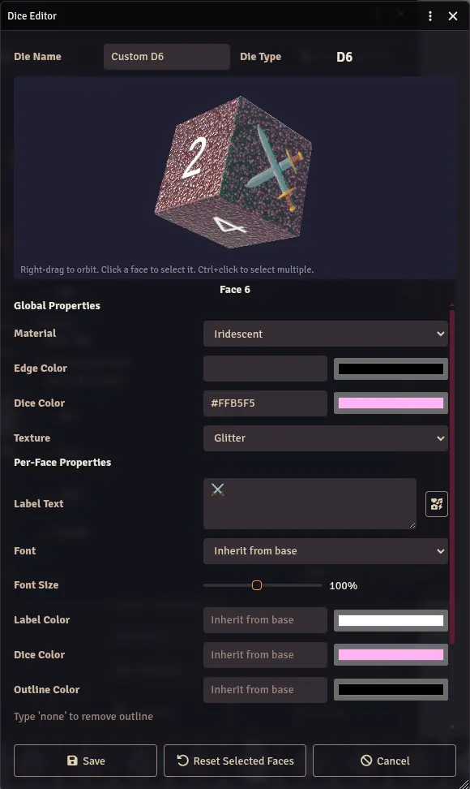

The Dice Editor lets you create fully custom dice with per-face labels, images, icons, and property overrides. Custom dice are stored in your personal Dice Library and can be shared with other players.

## Accessing the Editor

1. Open the [Dice Library](/foundryvtt-dice-so-nice/guide/dice-library/) from the Appearance tab (click a die type in the 3D preview first).
2. From the Library, click **Create** to start a new die, or **Edit** to modify an existing one.

## Creating a Die

1. Enter a **Die Name** to identify it in your library.
3. Choose a **Die Type** (d4, d6, d8, d10, d12, d20, etc.).
4. Set the **Global Properties** that apply to all faces: theme (colorset), colors, texture, material, and font.
5. Customize individual faces as needed (see below).
6. Click **Save** to add the die to your library.

## The 3D Preview

The editor includes a live 3D preview of your die:

- **Right-drag** to orbit the camera around the die.
- **Click** a face to select it for editing.
- **Ctrl+click** to select multiple faces at once.

The preview updates in real time as you change properties.

## Editing Faces

When no face is selected, the editor shows **Global Properties** that apply to every face. Once you click a face on the 3D preview, the panel switches to **Per-Face Properties** for that face.

### Per-Face Options

- **Label Text** - Type custom text for the face. Supports any Unicode character.
- **Label Image** - Upload or select an image file to use as the face label.
- **Font Size** - Scale the font size for this face.
- **Image Size** - Scale the image on this face.
- **Flip Vertical** - Flip the label image vertically.
- **Vertical Position** - Adjust the vertical placement of the image on the face.
- **Glow** - Add a glow effect to the face label.

Per-face properties override the global settings for that specific face. To undo per-face changes, click **Reset Selected Faces** to revert them to the global defaults.

## The Glyph Picker

When editing label text, you can use the glyph picker to insert icons and emojis. This gives you access to a library of symbols without needing to find Unicode characters manually. Click the glyph picker icon next to the label text field to browse available glyphs.

## Dice Library

All custom dice you create are stored in your personal [Dice Library](/foundryvtt-dice-so-nice/guide/dice-library/). Once saved, a custom die appears as a **Library Custom Die** option in the appearance settings dropdown for its die type. See the [Dice Library](/foundryvtt-dice-so-nice/guide/dice-library/) page for details on managing your collection.

## Import and Export

Custom dice definitions are included when you export your settings from the [Profiles & Data](/foundryvtt-dice-so-nice/guide/save-files/) tab. This lets you back up your designs or transfer them between worlds.
