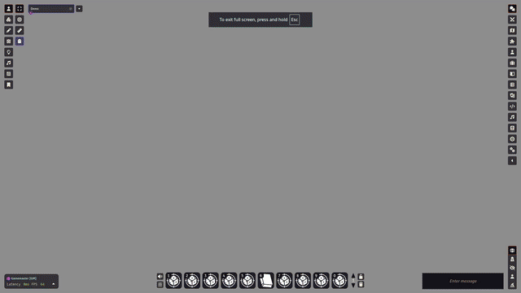

Dice So Nice! adds 3D dice animations to Foundry VTT. Every time a roll is made, animated 3D dice appear on screen, simulate physics, and land on the correct result.

## Installation

Search for **"Dice So Nice"** in the module browser inside Foundry VTT (Configuration and Setup > Game Modules > Install Module).

Alternatively, install manually:

1. Inside Foundry, select the **Game Modules** tab in the Configuration and Setup menu.
2. Click **Install Module** and enter the following manifest URL:
   ```
   https://gitlab.com/riccisi/foundryvtt-dice-so-nice/raw/master/module/module.json
   ```
3. Click **Install** and wait for installation to complete.

Dice So Nice! is also available on [The Forge](https://forge-vtt.com/bazaar#package=dice-so-nice).

## First Roll

Once the module is enabled in your world, 3D dice will automatically appear every time a roll is made - no additional setup needed.



## Accessing Settings

To customize your dice:

1. Open the **Module Settings** (gear icon in the sidebar > Module Settings).
2. Find **Dice So Nice!** in the list.
3. Click the **Dice So Nice!** button to open the configuration dialog.

You can also open the configuration dialog from the **Dice So Nice! sidebar tab** (visible in the right sidebar unless hidden by the GM).

The settings dialog has several tabs:

- **Appearance** - Customize how your dice look (colors, textures, materials, fonts).
- **Preferences** - Control behavior (auto-hide, sounds, speed, layer position).
- **Special Effects** - Add animations triggered by specific roll results.
- **Display** - Adjust rendering quality and visual options.
- **Profiles & Data** - Manage setting profiles and back up or restore your configuration.

## GM Settings

GM settings are configured in the Module Settings panel and affect all players in the world.

### Action Buttons

Three buttons are available in the Dice So Nice! section of Module Settings:

- **Dice So Nice!** - Opens the main configuration dialog.
- **Rollable Area** - Opens the rollable area configuration (see [Rollable Area](/foundryvtt-dice-so-nice/guide/rollable-area/)).
- **Damage Type Mapping** (GM only) - Opens the damage type mapping dialog (see [Preferences](/foundryvtt-dice-so-nice/guide/preferences/#damage-type-mapping-gm-only)).
- **Custom Dice Terms** (GM only) - Opens the custom dice terms dialog (see [Custom Dice Terms](/foundryvtt-dice-so-nice/guide/custom-dice-terms/)).

### Settings Worth Noting

Most GM settings are self-explanatory from their in-app labels and hints. The following benefit from extra context:

- **Max Number of Dice** - Applies independently to rolled dice and persistent tabletop dice. Each pool has its own cap.
- **Simultaneous rolls are merged** - Merges rolls from different simultaneous actions (e.g. two players rolling at the same time) into a single animation.
- **Same-message rolls are merged** - When a single chat message contains multiple rolls, play all dice at once instead of sequentially by roll order.
- **Show Ghost dice for hidden rolls** - Shows faceless dice to players on GM/Blind rolls. Three options: disabled, visible to all players, or visible to the roll author only.
- **Dice can be flipped** - Lets newly rolling dice flip settled dice on impact. Purely visual, does not affect results.

## Keyboard Shortcuts

Dice So Nice! registers two keybindings that can be customized in Foundry's **Configure Controls** menu:

- **Dismiss visible dice** - Instantly clear any non-persistent 3D dice currently on screen.
- **Delete selected persistent dice** - Remove persistent dice you have selected. Non-GM players can only delete their own dice.
