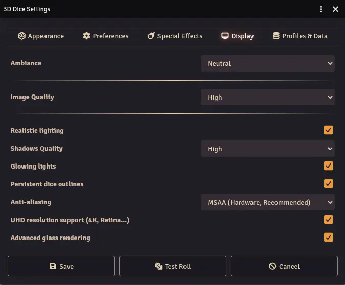

The Display tab controls the visual rendering of your 3D dice, from ambient lighting to performance-related quality settings.

## Ambiance

- **Ambiance** - Select the lighting environment for your dice. Each ambiance provides different lighting and reflection patterns:
  - **Neutral** - Clean, balanced lighting
  - **Tavern** - Warm, atmospheric lighting
  - **Neon** - Vibrant, colorful lighting

## Quality Preset

- **Image Quality** - Choose from quality presets (Low, Medium, High) that automatically configure the settings below. You can also adjust each setting individually after selecting a preset.

## Rendering Settings

- **Advanced Lighting** - When enabled, uses realistic lighting (HDRI environment map). Disabling this drastically reduces visual quality but significantly improves performance.
- **Shadows Quality** - Select the shadow resolution (none, low, medium, high). Lower shadow quality can help on weaker GPUs.
- **Glowing Lights** - When enabled, dice with light effects (e.g., glowing materials) will emit a glow. Disable to save GPU resources.
- **Persistent Dice Outlines** - When enabled, outlines are shown when a player picks up (holds) persistent dice, indicating which dice are being interacted with. Remote players also see outlines for dice held by other players, drawn in the holding player's color.
- **Anti-aliasing** - Smooth the edges of dice:
  - **MSAA (Hardware)** - Best quality, recommended for most GPUs
  - **SMAA (Software)** - Lighter alternative for older hardware
- **UHD Resolution Support** - Upscales the 3D rendering to take advantage of high-DPI screens (Retina, 4K). Only has an effect on HiDPI displays. Requires a high-end GPU.
- **Advanced Glass** - Enables realistic glass rendering with refraction and advanced transparency effects. Disable for better performance.
