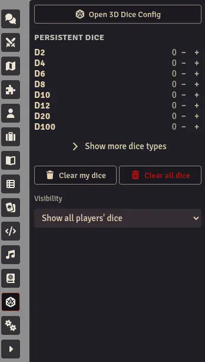

Persistent Dice lets you place 3D dice directly on the virtual tabletop. Unlike regular dice that appear during a roll and disappear, persistent dice stay visible on screen and can be physically interacted with, recreating the experience of rolling real dice around a physical tabletop.

## How It Works

Persistent dice use Foundry VTT's built-in random number generator (RNG) to determine results, not physics. When you throw a persistent die, Foundry generates the result and the die animation is adjusted to land on that number. This ensures fair, deterministic results while keeping the physics-based animation looking natural.

## Adding Dice

Use the **Persistent Dice Toolbox** to add dice to the tabletop:

1. Open the toolbox from the scene controls.
2. Select the die type you want to add (d4, d6, d8, d10, d12, d20, etc.).
3. The die appears on the tabletop using your current appearance settings.

## Interacting with Dice

### Pick Up and Move

- **Click and hold** a die to pick it up.
- Move your mouse to reposition it.
- **Release gently** (without momentum) to place it back down without rolling.

### Throw

- **Click and hold** a die, then **shake** it (move the mouse back and forth quickly) or **make a circle** with the mouse while holding.
- The gesture detection counts direction reversals (shaking) and rotational sweep (circular motion). Simply dragging and releasing quickly will not trigger a throw.
- The result appears in the chat log, just like any other Foundry roll.

### Multi-Select

- Hold **Ctrl** and click individual dice to select multiple.
- All selected dice can be thrown together.

## Removing Dice

- Use the **Remove** button in the toolbox to remove the most recently placed die.
- Or drag a die to the **trash zone** to remove it.

## Visibility

You can toggle the visibility of all persistent dice from the toolbox. This hides/shows them without removing them.

## Multiplayer

- All players in the world can see persistent dice placed by any player.
- Dice use the placing player's appearance settings.
- When a player picks up a die, it is **locked** for other players - only one person can interact with a die at a time.
- Positions are synchronized across different screen resolutions using relative coordinates.

