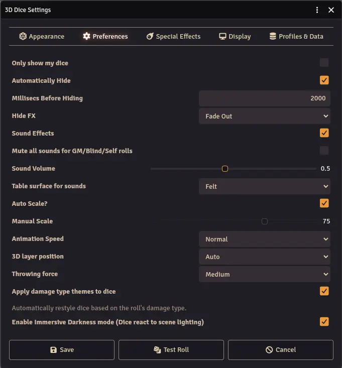
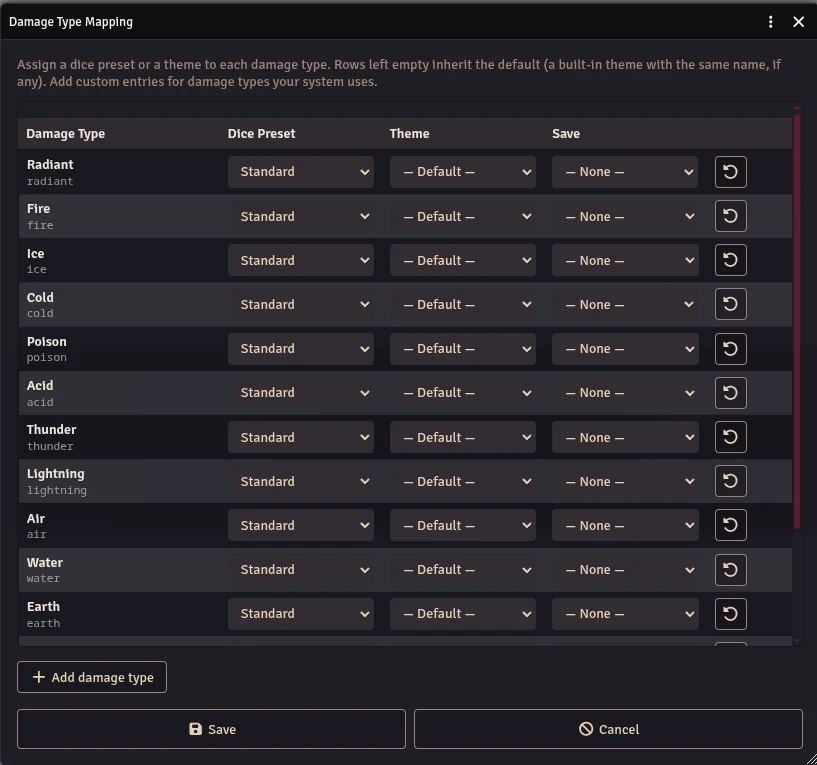

The Preferences tab controls how dice behave during and after a roll.

## Visibility

- **Only show my dice** - When enabled, you won't see other players' 3D dice rolls.
- **Automatically Hide** - When enabled, dice disappear automatically after the result is displayed.
- **Millisecs Before Hiding** - Time in milliseconds before dice auto-hide (default: 2000ms). Only visible when Automatically Hide is enabled.
- **Hide FX** - The visual effect used when dice disappear (fade out, etc.).

## Sound

- **Sound Effects** - Enable collision sounds with realistic rolling effects.
- **Mute all sounds for GM/Blind/Self rolls** - Prevents players from hearing your secret dice through voice chat.
- **Sound Volume** - Dice sound effect volume. Applied on top of Foundry's "Interface" volume slider.
- **Table surface for sounds** - The type of surface sound: felt, wood table, wood tray, or metal.

## Scale and Speed

- **Auto Scale** - Automatically scales dice size based on your display dimensions.
- **Manual Scale** - Set a custom dice size (only when Auto Scale is off).
- **Animation Speed** - How fast the dice roll and settle (Normal, 2x, 3x).

## Display

- **3D Layer Position** - Controls where dice appear relative to the Foundry UI:
  - **Auto** - Respects Foundry's focus system. The 3D overlay layer position adjusts based on what currently has focus (the canvas, a character sheet, etc.), following Foundry's native window stacking behavior.
  - **Over sheets** - Dice always appear on top of everything.
  - **Under sheets** - Dice appear below the UI, visible only on the canvas.

## Physics

- **Throwing Force** - The intensity of the roll: weak, medium, or strong. Affects how far dice travel and how much they bounce.

## Damage Type Themes

- **Apply damage type themes to dice** - When enabled, damage types (fire, cold, radiant, etc.) can automatically apply matching color themes to your dice. Disable to always use your own appearance settings regardless of damage type.

### Damage Type Mapping (GM Only)

The GM can configure which appearance is used for each damage type. The **Damage Type Mapping** button is available in the Dice So Nice! section of Module Settings (see [Getting Started](/foundryvtt-dice-so-nice/guide/getting-started/#action-buttons)).

From the mapping dialog, the GM can:

- **Map each damage type** to a specific dice preset (system) and/or theme (colorset).
- **Add custom damage types** by providing an id and a display label.
- **Delete custom damage types** that are no longer needed.
- **Reset to defaults** to restore the built-in mappings.

Built-in damage types include: fire, acid, cold, radiant, poison, thunder, lightning, air, water, earth, force, psychic, necrotic, and ice.

## Immersive Darkness

- **Enable Immersive Darkness mode** - When enabled, the scene's darkness level affects the dice lighting, making dice dimmer in dark scenes for added immersion.
