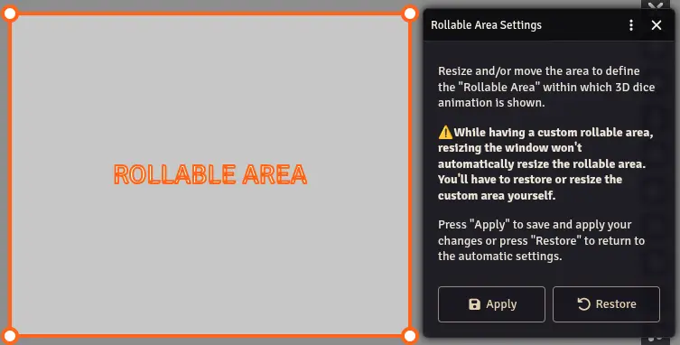

The Rollable Area setting lets you restrict where dice animate on your screen. By default, dice use the entire browser window. You can resize and reposition the rolling area to fit your layout.

## Use Cases

- **Streaming** - If you stream your Foundry session and only show a portion of the canvas, you can confine dice to the visible area.
- **Multi-monitor** - Keep dice in a specific region to avoid them rolling into UI panels or sidebars.
- **Screen real estate** - On smaller screens, a tighter rolling area keeps dice from obscuring the map.

## Configuration

1. Open the Dice So Nice! settings.
2. Navigate to the **Rollable Area** section.
3. A resizable, draggable rectangle appears on screen.
4. Resize and move the rectangle to define your preferred rolling area.
5. Click **Apply** to save, or **Restore** to reset to the full screen default.

## Notes

- The custom rollable area is **static** - it does not adapt when you resize the browser window. If you change your window size, re-adjust the rollable area.
- If **Auto Scale** is enabled in Preferences, dice size adapts to the rollable area dimensions. This means dice will appear smaller in a smaller area. You can disable Auto Scale and set a manual size to compensate.
