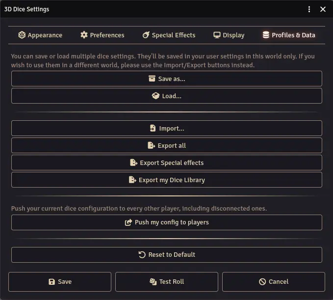

The Profiles & Data tab lets you manage your dice configuration. You can save multiple profiles and switch between them, or share settings with others.

## Save and Load

- **Save As** - Save your current settings to a named profile. You can create an unlimited number of profiles to quickly switch between different configurations.
- **Load** - Load a previously created profile, restoring all its settings.

## Import and Export

- **Import** - Import a Dice So Nice! settings file (JSON) from your computer. This will overwrite your current settings but not your saved profiles. This operation can't be undone.
- **Export All** - Export all settings (appearance, preferences, special effects, display) to a JSON file.
- **Export Special Effects** - Export only your special effects list to a JSON file. Useful for sharing SFX configurations without overwriting someone's appearance.
- **Export my Dice Library** - Export your custom dice created in the Dice Editor.

## GM Tools

These options are only available to the Game Master:

- **Push my config to players** - Push your current dice configuration to every other player, including disconnected ones. You can choose which parts to push: dice appearance, special effects, and/or preferences & display settings.

## Reset

- **Reset to Default** - Reset all settings to their default values. This cannot be undone.
