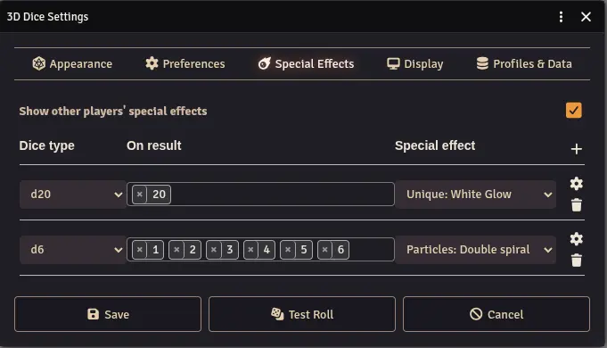
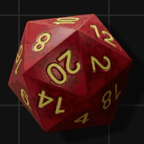
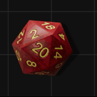
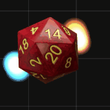
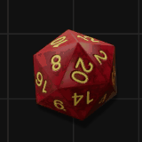
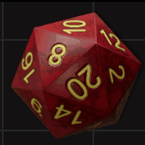
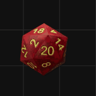

Special Effects (SFX) are short animations and/or sounds that play when a die lands on a specific result. For example, you can trigger a flash of light when you roll a natural 20 on a d20.

## Configuration

- **Show other players' special effects** - When enabled, SFX from other players' settings will play on your screen. Disable to only see your own effects.
- **Settings (gear icon)** - Some effects have additional options. Click the gear icon next to an effect to configure them.
- **Add** - Add a new special effect by choosing the die type, the result value, and the effect to trigger.

## Available Effects

### Bright

A flash of bright light radiating from the die.

### Impact

A shockwave ripple expanding from the die.

### Thormund

A custom character animation.

<video controls width="320">
  <source src="/foundryvtt-dice-so-nice/wiki/thormund.mp4" type="video/mp4">
</video>

### Spiral

A spinning spiral pattern around the die.

### Vortex

A swirling vortex of particles.

### Dark

A dark aura emanating from the die.

### Sparkles

Sparkles of light radiating from the die.

### Outline

A glowing outline effect around the die.

### Sound: Epic Win

Plays a built-in victory sound.

### Sound: Epic Fail

Plays a built-in failure sound.

### Sound: Custom

Plays a custom sound file. You can specify a direct file path to an audio file, or pick a Foundry playlist. When a playlist is selected, a random sound from that playlist is played each time the effect triggers.

### Macro

Executes a Foundry macro when the effect triggers.

### Confetti

Three intensity levels of confetti effects. Requires the external [Confetti](https://foundryvtt.com/packages/confetti) module to be installed and active.

:::note
The SFX gallery images above show a selection of built-in effects. Modules can also register additional custom effects via the [SFX API](/foundryvtt-dice-so-nice/api/sfx/).
:::
